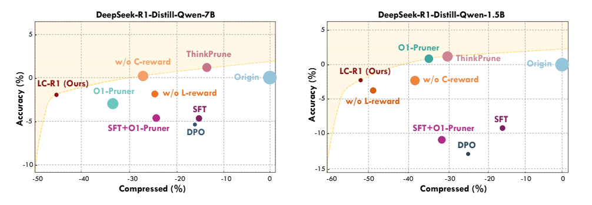
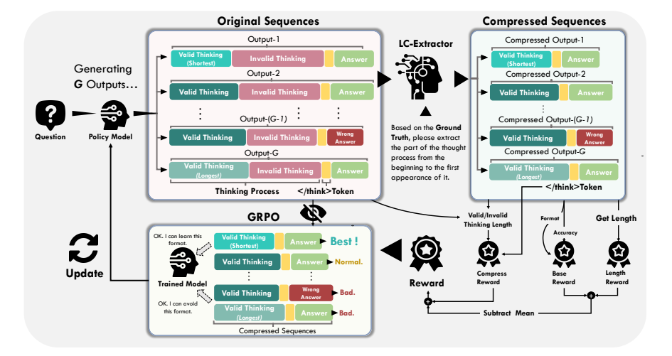
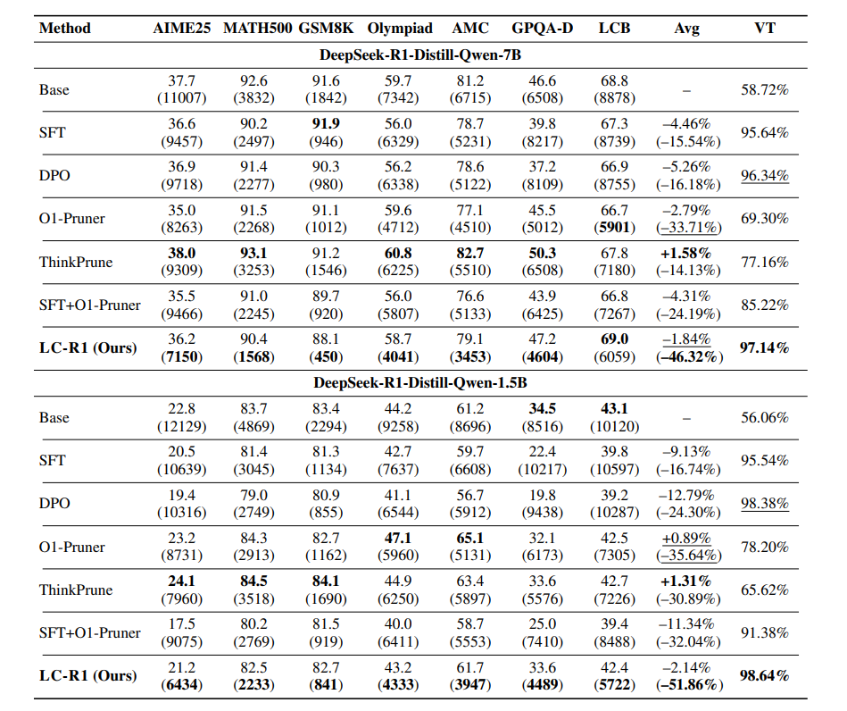

# Optimizing Length Compression in Large Reasoning Models (LC-R1)

<p align="center">
<strong><a href="https://arxiv.org/abs/2506.14755">📃Paper</a> | <a href="https://huggingface.co/collections/zx10086/lc-r1-685a7f3a33f3ba17f2c493b8">🤗Models & Datasets Repo</a></strong>
</p>

This repository contains the official implementation for the paper **"Optimizing Length Compression in Large Reasoning Models"**.

Our work introduces **LC-R1**, a novel post-training method to compress the lengthy reasoning process of Large Reasoning Models (LRMs). By identifying and eliminating "invalid thinking"—redundant self-verification after a correct answer is found—LC-R1 significantly improves computational efficiency. Our two core principles, **Brevity** and **Sufficiency**, guide the model to produce concise yet complete reasoning.

On average, across multiple benchmarks and two model sizes (1.5B and 7B), **LC-R1 achieves approximately 50% token reduction in the reasoning process with only a marginal ~2% drop in accuracy**.


Below is the Pareto analysis showing the trade-off between reasoning length compression and accuracy. LC-R1 achieves a superior position on the frontier, indicating high compression with minimal performance degradation.


*<p align="center">Figure 1: Pareto analysis of the Efficacy-Efficiency trade-off.</p>*

---

## 🚀 News

* **[06/2025]** We are excited to release the code, models, and datasets for the paper "Optimizing Length Compression in Large Reasoning Models"!

---

## 📖 Introduction

Large Reasoning Models (LRMs) have shown remarkable capabilities but often produce overly verbose and computationally expensive reasoning chains, a phenomenon we term "overthinking". A key issue is "invalid thinking," where models repeatedly double-check their work after deriving the correct answer.

To address this, we propose **LC-R1**, a post-training method based on Group Relative Policy Optimization (GRPO). LC-R1 uses a dual-reward system:
1.  A **Length Reward** to encourage overall conciseness.
2.  A **Compress Reward** to specifically penalize "invalid thinking" and terminate the reasoning process once the correct answer is found.

This approach effectively balances **Brevity** (eliminating redundancy) and **Sufficiency** (preserving essential reasoning steps). The diagram below illustrates our method's pipeline.


*<p align="center">Figure 2: The LC-R1 training pipeline.</p>*

---

## 📊 Performance

We evaluated LC-R1 on two model sizes (DeepSeek-R1-Distill-Qwen-7B and 1.5B) across seven diverse reasoning benchmarks, including mathematics, general reasoning, and coding tasks.

The results demonstrate that LC-R1 consistently outperforms other compression methods. It provides the best trade-off between efficiency and efficacy, achieving substantial token reduction while maintaining competitive accuracy. Furthermore, LC-R1 models exhibit a significantly higher Valid Thinking (VT) rate (over 97%), confirming their ability to eliminate redundant reasoning effectively.

Below are the main results from our experiments.


*<p align="center">Table 1: Main experimental results on accuracy and sequence length.</p>*

---

## ⚙️ Implementation

Follow these steps to set up the environment, download the necessary resources, and run the training scripts.

### 1. Installation

First, create and activate a conda environment. Then, clone the repository and install the required dependencies.

```bash
# Create and activate a new conda environment
conda create -n lcr1 python=3.10
conda activate lcr1

# Clone the repository
git clone https://github.com/zxiangx/LC-R1.git
cd LC-R1

# Install the project in editable mode and dependencies
pip install -e .
````

### 2\. Download Resources

Run the provided script to download the models and datasets from Hugging Face Hub.

```bash
cd scripts
python pull_from_hub.py
```

### 3\. Training

To start training, you need to configure the model and save paths in the shell scripts.

1.  Open `scripts/lcr1_7B.sh` (or `scripts/lcr1_1.5B.sh`).
2.  Modify the `MODEL_PATH` and `SAVE_PATH` variables to your actual paths.
      * `MODEL_PATH`: Path to the pre-trained model you want to fine-tune.
      * `SAVE_PATH`: Directory where the trained model and checkpoints will be saved.

Once configured, execute the script to begin training:

```bash
# For the 7B model
bash scripts/lcr1_7B.sh

# Or for the 1.5B model
bash scripts/lcr1_1.5B.sh
```

**Training Outputs:**

  * Model checkpoints will be saved to `$SAVE_PATH/ckpt`.
  * The final trained model parameters will be stored in `$SAVE_PATH/model`.
  * Training logs of vllm will be written to `scripts/log/vllm.log`.

**Customizing Training:**

  * To modify training parameters (e.g., learning rate, batch size), edit the configuration files located in `scripts/train.py`.
  * To modify the parameters of deepspeed, modify the `scripts/accelerate_configs/` file.

-----

## 📝 Citation

If you find the content of this project helpful, please cite our paper as follows:

```bibtex
@misc{cheng2025optimizinglengthcompressionlarge,
      title={Optimizing Length Compression in Large Reasoning Models}, 
      author={Zhengxiang Cheng and Dongping Chen and Mingyang Fu and Tianyi Zhou},
      year={2025},
      eprint={2506.14755},
      archivePrefix={arXiv},
      primaryClass={cs.AI},
      url={https://arxiv.org/abs/2506.14755}, 
}
```
